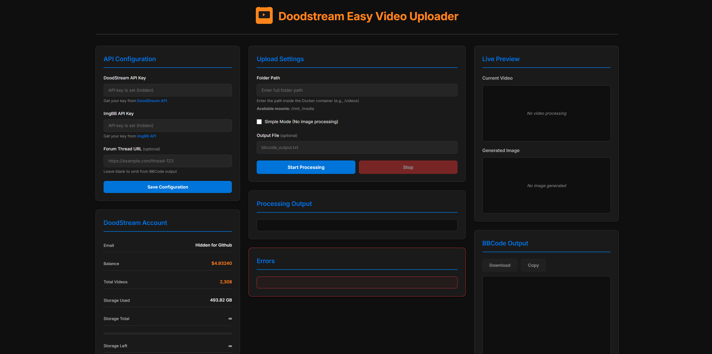
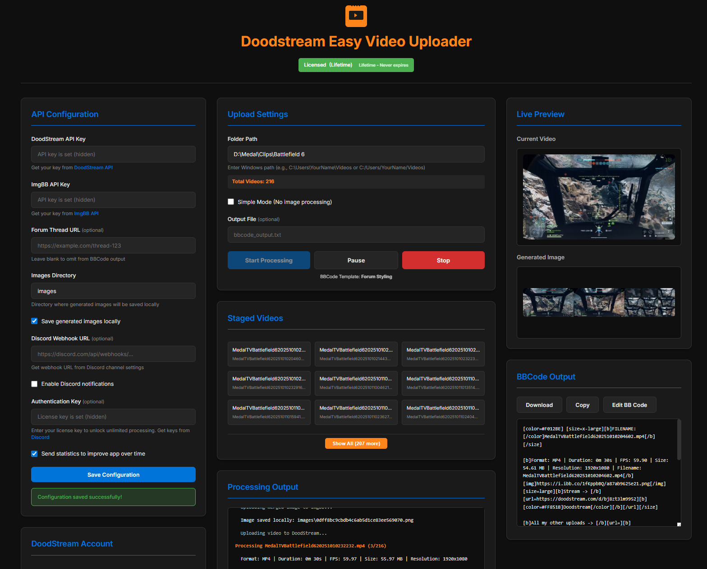

# DoodStream Easy Video Uploader

## Upload Videos to DoodStream Has Never Been Easier

**DoodStream Easy Video Uploader** is the ultimate Windows application for effortlessly uploading videos to DoodStream. Process multiple videos simultaneously, generate custom BBCode automatically, and manage your entire workflow from one powerful interface.

### 🚀 [Download Now →](https://doodstream-uploader.rf.gd)

---

## See It In Action

*The intuitive interface makes uploading videos to DoodStream effortless. Configure your settings, select your videos, and let the app handle the rest.*

---

## Why Choose DoodStream Easy Video Uploader?

### ⚡ Lightning Fast Performance
Process and upload multiple videos simultaneously with optimized performance. No more waiting around - get your videos online faster than ever before.

### 🎯 One-Click Batch Processing
Simply select a folder and let the app do the rest. Automatically finds all videos, processes them, and uploads to DoodStream with zero manual intervention.

### 📝 Automatic BBCode Generation
Generate beautiful, customizable BBCode for forum posts automatically. Choose from pre-built templates or create your own - perfect for sharing your uploads.

### 🖼️ Smart Image Processing
Automatically creates preview images and collages from your videos. Uploads to ImgBB and integrates seamlessly into your BBCode output.

### 🎥 Live Video Preview
Watch your videos as they're being processed with real-time preview. See exactly what's happening at every step of the way.

### 🔔 Discord Notifications
Get instant notifications when uploads complete. Stay informed without constantly checking the app.

### ⏸️ Full Control
Pause, resume, or stop processing at any time. You're in complete control of your upload workflow.

### 🔒 Secure & Private
All your data is stored locally in Windows Registry. Your API keys and settings never leave your computer.

### 📊 Real-Time Account Stats
Monitor your DoodStream account balance, storage usage, video count, and earnings directly in the app.

### 🌐 Remote Access
Access your uploader from anywhere in the world with simple port forwarding. Upload videos remotely from any device with a web browser.

---

## How It Works

### 1. **Download & Run**
Download the Windows executable and run it directly - no installation needed! The app opens in your web browser automatically.

### 2. **Add Your API Keys**
Enter your DoodStream and ImgBB API keys. Everything is stored securely on your local machine.

### 3. **Select Your Videos**
Choose the folder containing your videos. The app automatically scans and finds all video files.

### 4. **Start Uploading**
Click start and watch the magic happen. Videos upload automatically with BBCode generation, image processing, and real-time progress tracking.

---

## Key Features

- ✅ **Batch Video Processing** - Process entire folders of videos automatically
- ✅ **DoodStream Integration** - Direct upload with streaming links
- ✅ **BBCode Generator** - Customizable templates for forum posts
- ✅ **Image Processing** - Auto-generate preview collages
- ✅ **ImgBB Integration** - Automatic image hosting
- ✅ **Live Preview** - Real-time video and image preview
- ✅ **Progress Tracking** - Monitor upload status in real-time
- ✅ **Pause & Resume** - Full control over processing
- ✅ **Discord Notifications** - Get notified when uploads complete
- ✅ **Account Statistics** - View DoodStream account info
- ✅ **Remote Access** - Access from anywhere with port forwarding
- ✅ **Secure Storage** - All data stored locally
- ✅ **No Limits** - Unlimited processing with license key

---

## Pricing

### 💰 Daily - $2/day
Perfect for occasional users. Full access to all features for 24 hours.

### 💰 Monthly - $15/month
**Most Popular** - Best value for regular users. Unlimited uploads and full feature access.

### 💰 Lifetime - $60 one-time
**Best Deal** - Pay once, use forever. Never worry about renewals again.

**Get your license key:** [Join our Discord →](https://discord.gg/uwMAyrA7Wg)

---

## Supported Video Formats

- MP4, MOV, AVI, MKV, FLV, WMV, WEBM, M4V

---

## System Requirements

- **Windows 10/11** (64-bit)
- Internet connection for uploads
- DoodStream API key
- ImgBB API key (optional, for image hosting)

---

## Get Started Today

### 🎯 [Visit Our Website](https://doodstream-uploader.rf.gd)

Download the application, get your license key, and start uploading videos to DoodStream effortlessly.

### 💬 [Join Discord Community](https://discord.gg/uwMAyrA7Wg)

Get support, purchase license keys, and connect with other users.

---

## SEO Keywords

**DoodStream Uploader** | **DoodStream Video Uploader** | **Batch Video Upload** | **DoodStream BBCode Generator** | **Video Processing Tool** | **DoodStream Automation** | **Video Upload Software** | **DoodStream Tool** | **BBCode Generator** | **Video Uploader Windows** | **DoodStream Batch Upload** | **Automated Video Upload** | **DoodStream Integration** | **Video Processing Software** | **DoodStream Upload Tool**

---

## About

**DoodStream Easy Video Uploader** is developed to make video uploading to DoodStream as simple and efficient as possible. No technical knowledge required - just download, configure, and start uploading.

---

## Support

Need help? Have questions? Want to purchase a license?

👉 **[Visit Our Website](https://doodstream-uploader.rf.gd)**  
👉 **[Join Discord](https://discord.gg/uwMAyrA7Wg)**

---

**© 2024 DoodStream Easy Video Uploader. All rights reserved.**
